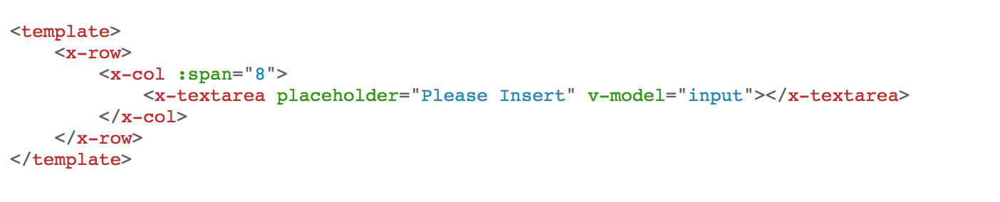
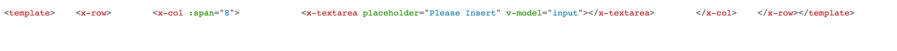

# vue-2.4.1-test

> Vue 2.3.4 & 2.4.1 has different behavior in pre tag compilation


## Steps to Reproduce


1. pre compile in 2.3.4

```bash
# install vue2.3.4 and vue-template-compiler 2.3.4
npm install

npm run dev
```

Which works well.





2. in 2.4.1

```bash
# install vue2.3.4 and vue-template-compiler 2.3.4
npm i vue@2.4.1 vue-template-compiler@2.4.1

npm run dev
```




### By compare two html contents it seems `\n` has removed in 2.4.1.

## Build Setup

``` bash
# install dependencies
npm install

# serve with hot reload at localhost:8080
npm run dev

# build for production with minification
npm run build

# build for production and view the bundle analyzer report
npm run build --report
```

For detailed explanation on how things work, checkout the [guide](http://vuejs-templates.github.io/webpack/) and [docs for vue-loader](http://vuejs.github.io/vue-loader).
